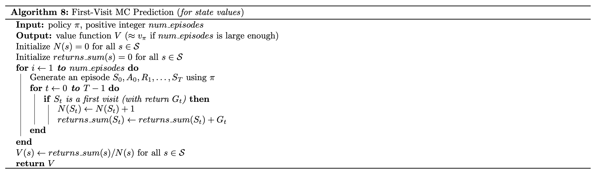
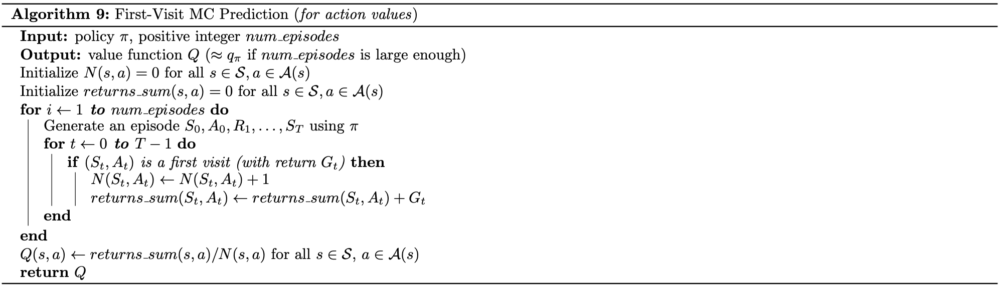
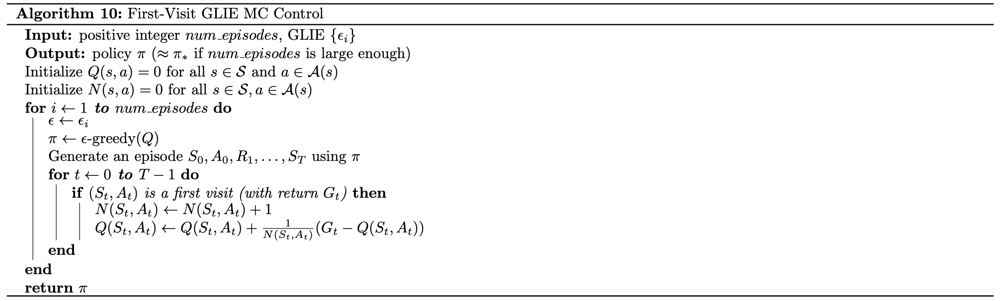
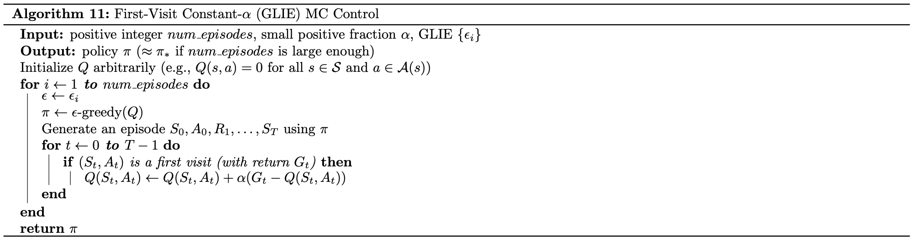

# Monte Carlo Methods


- Monte Carlo methods - even though the underlying problem involves a great degree of randomness, we can infer useful information that we can trust just by collecting a lot of samples.
- The **equiprobable random policy** is the stochastic policy where - from each state - the agent randomly selects from the set of available actions, and each action is selected with equal probability. 

### MC Prediction
------

- Algorithms that solve the **prediction problem** determine the value function vπ (or qπ) corresponding to a policy π.
- When working with finite MDPs, we can estimate the action-value function qπ corresponding to a policy π in a table known as a **Q-table**. This table has one row for each state and one column for each action. The entry in the s-th row and a-th column contains the agent's estimate for expected return that is likely to follow, if the agent starts in state s, selects action a, and then henceforth follows the policy π.
- Each occurrence of the state-action pair s,a (s∈S,a∈A) in an episode is called a **visit to s,a**.
- There are two types of MC prediction methods (for estimating qπ):
  - **First-visit MC** estimates qπ(s,a)  as the average of the returns following *only first* visits to s,a (that is, it ignores returns that are associated to later visits).
  - **Every-visit MC** estimates qπ(s,a) as the average of the returns following *all* visits to s,a.





```python
def every_visit_mc_prediction_q(env, num_episodes, generate_episode, gamma=1.0):
    N = defaultdict(lambda: np.zeros(env.action_space.n))
    Q = defaultdict(lambda: np.zeros(env.action_space.n))
    returns_sum = defaultdict(lambda: np.zeros(env.action_space.n))

    for i_episode in range(1, num_episodes+1):
        episode = generate_episode(env)
        states, actions, rewards = zip(*episode)
        discounts = np.array([gamma**i for i in range(len(rewards)+1)])

        for i, state in enumerate(states):
            N[state][actions[i]] += 1 
            returns_sum[state][actions[i]] += sum(rewards[i:]*discounts[:-(1+i)])
            Q[state][actions[i]] = returns_sum[state][actions[i]]/N[state][actions[i]] 
    
    return Q
```

### Exploration vs. Exploitation

------

- All reinforcement learning agents face the **Exploration-Exploitation Dilemma**, where they must find a way to balance the drive to behave optimally based on their current knowledge (**exploitation**) and the need to acquire knowledge to attain better judgment (**exploration**).

- In order for MC control to converge to the optimal policy, the Greedy in the Limit with Infinite Exploration (GLIE) conditions must be met:

  - every state-action pair s,a (for all s∈S* and a∈A(s)) is visited infinitely many times, and 
  - the policy converges to a policy that is greedy with respect to the action-value function estimate Q..

### Greedy Policies

------

- A policy is **greedy** with respect to an action-value function estimate Q if for every state s∈S, it is guaranteed to select an action a∈A(s) such that a=argmaxa∈A(s)Q(s,a). (It is common to refer to the selected action as the **greedy action**.)
- In the case of a finite MDP, the action-value function estimate is represented in a Q-table. Then, to get the greedy action(s), for each row in the table, we need only select the action (or actions) corresponding to the column(s) that maximize the row.

**Epsilon-Greedy Policies :**

A policy is **ϵ-greedy** with respect to an action-value function estimate Q if for every state s∈S, with probability 1−ϵ, the agent selects the greedy action, and with probability ϵ, the agent selects an action *uniformly* at random from the set of available (non-greedy **AND** greedy) actions.

**Incremental Mean :**

In this concept, we amended the policy evaluation step to update the Q-table after every episode of interaction.

### MC Control

------

- Algorithms designed to solve the **control problem** determine the optimal policy π∗ from interaction with the environment.
- The **Monte Carlo control method** uses alternating rounds of policy evaluation and improvement to recover the optimal policy.



### Constant-alpha

------

- In this concept, we derived the algorithm for **constant-α MC control**, which uses a constant step-size parameter α.
- The step-size parameter α must satisfy 0<α≤1. Higher values of α will result in faster learning, but values of α that are too high can prevent MC control from converging to π∗.



------
This project is a part of [Udacity Deep Reinforcement Learning Nanodegree](https://www.udacity.com/course/deep-reinforcement-learning-nanodegree--nd893). Follow the instructions in `Monte_Carlo.ipynb` to write your own implementations of many Monte Carlo methods!.